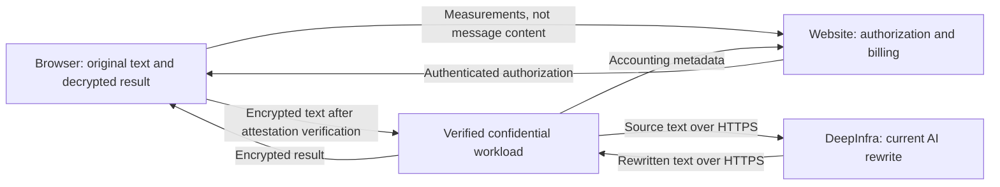

# Confidential architecture

This document explains SimpleUnmark's text-processing privacy modes, how confidential computing protects a request, and how approved software reaches production. The main sections explain the design; the appendices provide the technical verification contract and current operational limits.

## Overview

**Strict mode** does not log or retain the text submitted to SimpleUnmark or the cleaned result. It provides privacy through the application's content-handling rules, but the servers processing the request can still read the text while the request runs.

**Confidential mode** retains that no-content-retention policy and adds a technical barrier: the browser encrypts the text directly to a verified workload inside a trusted execution environment (TEE). The website backend does not receive readable text, and infrastructure administrator access does not provide ordinary access to the workload's plaintext or decryption keys. The current AI provider, DeepInfra, still receives the source text to perform the rewrite.

**Confidential AI** is the planned next step: run a self-hosted model on a confidential GPU so the rewrite also stays inside a verified protected environment, without sending text to DeepInfra. It is not implemented and is deferred because of cost.

> **Naming:** This document uses **Strict** for the existing mode currently labeled **Private** on the website and represented by `PRIVATE` in the protocol. These names refer to the same processing path, not two different modes. Changing the documentation does not change that protocol identifier.

For the current product labels and public privacy commitments, see [privacy modes](https://simpleunmark.com/confidential-ai) and the [privacy policy](https://simpleunmark.com/privacy).

## The three privacy modes

| Property                                                          | Strict                               | Confidential | Confidential AI                         |
| ----------------------------------------------------------------- | ------------------------------------ | ------------ | --------------------------------------- |
| Status                                                            | Available; currently labeled Private | Available    | Planned                                 |
| SimpleUnmark logs or retains message content                      | No                                   | No           | No, by design                           |
| Website backend receives readable text                            | Yes, during processing               | No           | No, by design                           |
| Browser verifies the processing environment before uploading text | No                                   | Yes          | Required by the planned design          |
| Additional content encryption from browser to protected workload  | No; HTTPS still protects transport   | Yes          | Required by the planned design          |
| Where AI rewriting happens                                        | DeepInfra                            | DeepInfra    | Self-hosted model on a confidential GPU |
| DeepInfra receives readable source text                           | Yes                                  | Yes          | No, by design                           |

The distinction is between **not retaining content** and **preventing infrastructure-level access to content while processing it**. Confidential mode adds the second protection; it does not replace the first.

### Strict mode: no content logging or retention

SimpleUnmark does not log, save, or retain the submitted message, cleaned result, or excerpts of either in its application databases, logs, analytics, or operational notifications. Text is handled transiently to perform the request, not stored as a message history.

This does not mean that no data about a request is kept. Account and billing records, request IDs, word and character counts, byte counts, status, timing, and usage telemetry are separate operational metadata. They do not contain the message's wording or the cleaned result.

Processing necessarily uses temporary memory. **No retention is not the same as no plaintext access:** the website backend receives the text and forwards it to the cleaning workload. An administrator with sufficient access to that backend could inspect memory or introduce request-body logging, even though the implemented application does not do so. Strict mode therefore depends on the application and its operators maintaining the stated behavior.

The text-processing path is:

```text
Browser → website backend → cleaning workload → DeepInfra
```

The result returns through the same services. HTTPS protects the public network connections, but the relevant endpoints can read the text. Strict mode uses the same cleaning and accounting pipeline as Confidential mode; the difference is how the text reaches it and who can read it on the way.

SimpleUnmark's no-content-retention commitment is distinct from DeepInfra's handling of its copy. Both current modes use that provider, whose privacy commitments and exceptions are described [below](#the-remaining-gap-deepinfra).

### Confidential mode: protect content during processing

A **trusted execution environment**, or TEE, is an isolated execution environment backed by hardware security features. It lets approved software process readable data while restricting access from outside that environment. SimpleUnmark uses Google's Confidential Space, which combines a confidential virtual machine, a hardened operating system, and signed evidence about the workload.

This addresses a gap left by HTTPS: transport encryption protects text while it travels, but ordinary server software must decrypt it. A TEE adds protection **while that software is processing the text**. The program inside the TEE still reads plaintext; this is not computation on permanently encrypted text.

See [Google's Confidential Space overview](https://docs.cloud.google.com/confidential-computing/confidential-space/docs/confidential-space-overview).

#### What happens if an administrator logs into a server?

Logging into the website server does not reveal Confidential-mode text: that server receives authorization and accounting metadata, not the message. Capturing the content payload at the load balancer reveals application-layer ciphertext, even after HTTPS termination.

The protected workload is different from an ordinary server an administrator can log into and debug. Production Confidential Space disables normal remote shell access. Hardware-backed memory encryption also protects against direct inspection of the VM's memory. Administrative control of the surrounding infrastructure does not grant an ordinary plaintext-inspection interface.

**Neither SimpleUnmark's infrastructure administrators nor Google Cloud's infrastructure operators can read this protected text merely by inspecting ingress traffic or encrypted VM memory.** Google still provides trusted platform components and attestation; this is not a claim of protection against every possible platform compromise. See [Google's security model](https://docs.cloud.google.com/docs/security/confidential-space).

#### Why adding logging or swapping the server is not enough

The approved workload's launch policy blocks container-output redirection and command/environment overrides. An infrastructure operator cannot simply turn these features on for that image. The browser also checks the attested security settings and exact approved software fingerprint before encrypting a request.

Replacing the workload with an unapproved logging build, substituting an attacker's encryption key, or using a debug environment fails the corresponding verification checks in an unchanged trusted client. The browser does not then upload the text.

These protections combine workload restrictions with browser verification; a TEE by itself does not prohibit approved software from sending data out. See the [Dockerfile](../apps/confidential-server/Dockerfile), [browser verifier](../packages/client/src/confidential-attestation.ts), and [Google's launch-policy reference](https://docs.cloud.google.com/confidential-computing/confidential-space/docs/reference/launch-policies).

The remaining client and software trust assumptions are collected in [What remains trusted](#what-remains-trusted). In particular, the current approved text workload deliberately sends text to DeepInfra.

### The remaining gap: DeepInfra

The workload first normalizes unusual spaces and removes selected invisible characters. It then sends the resulting **source text** to DeepInfra for rewriting. This cleanup is not redaction or anonymization: DeepInfra receives the message's content, not just an already-rewritten result.

HTTPS protects this connection in transit. At DeepInfra's endpoint, the text is readable so the model can process it. The browser's workload attestation does not cover DeepInfra's inference servers.

DeepInfra's [data-privacy documentation](https://docs.deepinfra.com/account/data-privacy), checked on September 16, 2026, describes in-memory processing, deletion of inputs and outputs after inference, and no training on submitted data for the current DeepSeek model. It also reserves limited request logging for debugging or security. These are privacy protections with stated exceptions, not an unconditional zero-retention guarantee or something the browser verifies cryptographically.

The same provider boundary applies to Strict and Confidential mode. Changes to the provider, model, or API require reviewing the applicable privacy terms again. The current request is implemented in [provider.py](../apps/confidential-server/simpleunmark_confidential/provider.py).

### Confidential AI: close the inference gap

Confidential AI is planned to run a self-hosted rewriting model inside a protected CPU-and-GPU environment. Instead of calling DeepInfra, the approved inference software would process the source text within that boundary and return an encrypted result to the browser.

**Self-hosting alone is not sufficient.** An ordinary GPU server would still expose plaintext to its administrators. Confidential GPUs, such as supported NVIDIA H100 configurations, add protected GPU execution, access controls around GPU memory, and device attestation. A secure CPU-to-GPU connection protects text and intermediate model data as they cross between the two processors.

The goal is a protected path from browser decryption inside the workload, through model inference, to response encryption. The approved programs must still read plaintext internally; the protection is against access from outside that execution boundary.

See [NVIDIA's confidential-computing explanation](https://developer.nvidia.com/blog/confidential-computing-on-h100-gpus-for-secure-and-trustworthy-ai/).

Before this mode can ship, its verification policy must cover the CPU environment, GPU evidence and production security mode, approved inference software, and how the model is loaded. It must prevent an unverified inference endpoint or external API fallback from silently receiving plaintext. This is a planned integration, not a property of the existing CPU-only verifier.

With that design implemented, DeepInfra would receive no text. The browser and the approved protected processing software would be the content endpoints. The existing client, software, and platform trust assumptions would still apply.

The feature is deferred because of the cost of hosting and operating suitable confidential GPU capacity. Today, using a hosted inference API avoids that standing cost. **Confidential AI is a future security guarantee, not a description of the currently deployed rewrite.**

## Where a Confidential request goes



This diagram shows logical data flows. The browser obtains and verifies attestation before sending encrypted text. In planned Confidential AI mode, inference would move inside the verified protected boundary, removing the DeepInfra content connection.

## Key terms

| Term           | Meaning                                                                                             |
| -------------- | --------------------------------------------------------------------------------------------------- |
| Plaintext      | Readable text before encryption or after decryption.                                                |
| Workload image | The packaged server program and its dependencies.                                                   |
| Image digest   | A cryptographic fingerprint identifying an exact workload image.                                    |
| Attestation    | Signed evidence about the running software and environment; not proof that the program is bug-free. |
| Capability     | A short-lived authenticated authorization for one cleaning request.                                 |
| Receipt        | An authenticated accounting message containing status and usage metadata, not content.              |
| HPKE           | Hybrid Public Key Encryption, used to encrypt a request to the workload's temporary public key.     |

## How a Confidential request works

### 1. Authorize without uploading the text

The browser measures words, characters, and input bytes locally. The website checks the account, reserves credits, and returns a request ID and a capability binding those measurements to the mode, origin, and expiry.

The capability uses HMAC, a message-authentication mechanism based on a shared secret. The workload checks it before accepting a request. **This shared authorization/accounting secret is not a content-encryption key.**

See [measurements](../packages/client/src/measurements.ts), [the shared protocol](../packages/client/src/clean-protocol.ts), and [capability validation](../apps/confidential-server/simpleunmark_confidential/security.py).

### 2. Obtain evidence tied to an encryption key

The browser generates a random challenge and requests attestation with its capability. The workload creates a temporary key pair and obtains a Google-signed token binding the challenge, request ID, and public key together.

The private key stays in workload memory. It is not sent to the website, stored in Secret Manager, or written to disk. The challenge and public key are not secret; the submitted text remains local until verification succeeds.

See [attestation handling](../apps/confidential-server/simpleunmark_confidential/attestation.py) and [cryptographic binding](../apps/confidential-server/simpleunmark_confidential/crypto.py).

### 3. Verify in the browser

The browser verifies Google's token signature, expected issuer and audience, approved image digest, workload identity, hardware and secure-launch settings, and the challenge/request/key binding.

Expected values come from trusted configuration embedded when the website is built. They are never learned from the workload's `/v1/info` response. Required allowlists with no valid entries cause rejection.

Verification must succeed before encryption and upload. This is **fail-closed verification**: failure blocks the request rather than silently falling back to Strict mode. It is not a claim that attestation detects every possible vulnerability in approved software or hardware.

See [the browser integration contract](../packages/client/README.md) and [Appendix A](#appendix-a-verification-and-encryption-details).

### 4. Encrypt, upload, and validate

The browser encrypts the text using HPKE and the attested public key. Both sides derive a separate response-encryption key from the same cryptographic context; it is not transmitted.

The workload validates the capability, decrypts the request, and checks that the word, character, and byte counts match. Mismatches are rejected rather than repriced. A `PRIVATE` authorization cannot use the Confidential endpoint, and vice versa.

Before billable processing, a metadata-only `started` receipt claims the website's reservation. If that claim is not acknowledged, the workload does not proceed with the rewrite. See [request handling](../apps/confidential-server/simpleunmark_confidential/app.py).

### 5. Clean, rewrite, and return the encrypted result

The workload applies deterministic cleanup and then the DeepInfra rewrite described above. Response events are encrypted and tied to the request and sequence number. The browser rejects altered events, unexpected ordering, and duplicates, then decrypts the result locally.

The response remains content-encrypted as it passes through infrastructure outside the workload. The website backend does not need the input or output to perform accounting. See [client cryptography](../packages/client/src/confidential-crypto.ts).

### 6. Settle without recording the message

The workload sends a final `succeeded` or `failed` receipt containing the request ID, authorized measurements, status, and usage telemetry. It includes no submitted text, rewritten text, or content excerpts.

The website settles credits and reconciles incomplete reservations when the workload stops or a final receipt cannot be delivered. A failed request alone is not proof that settlement has already completed. See [receipt handling](../apps/confidential-server/simpleunmark_confidential/receipts.py) and [Appendix B](#appendix-b-current-operational-behavior).

## Runtime protections and credentials

The current [runtime Terraform](../infra/gcp/terraform/main.tf) specifies a single Confidential Space VM using AMD SEV on AMD Milan, with Secure Boot, a virtual trusted platform module, and integrity monitoring. The VM has no public IP; incoming traffic uses Google's HTTPS load balancer and outgoing traffic uses Cloud NAT.

The [Dockerfile](../apps/confidential-server/Dockerfile) runs the application as a non-root user in a minimal image. Security-sensitive configuration, including the receipt URL, allowed origin, model endpoint, and attestation audience, is baked into that image. Changes require a new digest rather than runtime environment overrides.

Container-output redirection and workload memory-usage monitoring are disabled by launch policy. Memory-usage monitoring means metrics, not exporting memory contents. Infrastructure diagnostics and accounting metadata may still exist; disabling content logging does not mean there are no operational logs.

At startup, [bootstrap.py](../apps/confidential-server/simpleunmark_confidential/bootstrap.py) reads numeric Secret Manager version references from VM metadata and fetches the DeepInfra key and shared authorization/accounting secret. It uses fixed Google endpoints, disables proxy inheritance and redirects, verifies checksums and formats, and keeps credentials out of files and subprocess environments. Bootstrap failure stops startup.

Secret access uses service-account permissions, **not attestation-gated secret release**. A sufficiently privileged administrator can obtain those two credentials. Neither decrypts recorded HPKE requests; the workload's temporary private keys are separate.

## How software becomes trusted and deployed

Build evidence records which artifact was produced. Approval evidence records which policy was accepted. Runtime attestation identifies the image handling a request. The approved image digest connects these records; none proves that the code is safe on its own.

```text
Reviewed source → publish signed candidate → approve exact digests
                → export policy to website → operator deploys approved image
                → browser verifies runtime evidence before each upload
```

**Publication is not approval or deployment.** The release workflow builds one image, publishes identical digests to Docker Hub and Google Artifact Registry, and signs provenance for the workload and browser client. Its cloud credentials permit publication, not runtime deployment or access to workload secrets.

**Approval is explicit.** The policy names exact digests. Verification checks the expected repository identities, workflow, commits, runner restrictions, and transparency-log evidence. New images require evidence from both registries, with one explicitly recorded legacy exception. A separate approval-environment gate rechecks evidence and signs the policy. Transition checks preserve historical records and prevent reactivating revoked digests.

**The browser receives a checked policy snapshot.** Export verifies the policy's approval, usable image provenance, and the browser-client package's hash and provenance. The website embeds the policy at build time; the browser does not fetch a workload-supplied trust list.

**Deployment remains an operator action.** Terraform requires the selected digest to be active in the policy. It does not perform the signature checks itself; those belong to release/export verification. CI does not apply runtime Terraform. An unchanged trusted browser rejects unapproved digests even if an administrator changes the deployment outside Terraform.

See [release security](release-security.md), [policy verification](../scripts/release-policy.mjs), and the [deployment checklist](deployment-checklist.md).

### Human roles

Implementation, review, approval, and deployment are currently performed by **one maintainer**. Separate workflow gates provide deliberate checkpoints and evidence, not independent human review.

These roles can be split later. The repository supports requiring independent PR review and preventing environment-job self-approval, alongside appropriate reviewer assignments. Deployment permissions can belong to a different operator. Administrators able to change these protections remain trusted.

See [role configuration](../infra/github/main.tf) and [the setup guide](release-security.md#2-github-configuration).

### Rollout and revocation

A normal rollout first distributes a browser policy accepting both the old and new approved images, then switches the deployment target. Replacing the single VM can interrupt requests.

**Revocation changes the policy, not the image's digest.** New clients with the updated policy reject that digest, but already-open tabs retain the policy they loaded. Incident response may require stopping the affected workload or disabling Confidential authorization, not just publishing a new policy. See [rollout and incident procedures](release-security.md#rollout-rollback-and-revocation).

## What remains trusted

**Client delivery and the user's device.** The website supplies the JavaScript handling plaintext. A compromised website could deliver code that leaks content before encryption or changes verification. Infrastructure isolation is not protection against malicious replacement of the client itself. An independently distributed, pinned client would strengthen this boundary.

**Approved code and its dependencies.** Code inside the protected environment reads plaintext. Bugs or deliberately approved exfiltration are not prevented merely by running that code in a TEE. Review and release approval remain necessary.

**The computing and attestation platform.** The design relies on hardware, firmware, Confidential Space software, and Google's attestation service. Isolation from routine infrastructure access does not make the platform vendor wholly untrusted or eliminate the possibility of vulnerabilities.

**The current inference provider.** DeepInfra can read source text in both current modes. Planned Confidential AI removes that external content recipient, not the other trust assumptions.

**Operational metadata.** Identity, billing, counts, timings, and traffic sizes remain observable to the relevant services. No-content-retention and content encryption do not imply anonymity or that nothing about a request is recorded.

See [the full threat boundary](../apps/confidential-server/README.md#threat-boundary).

## Appendix A: Verification and encryption details

Production clients call `verifyConfidentialSpaceToken`. The separately exported `validateConfidentialSpaceClaims` helper does not verify signatures and must not replace it.

Tokens are checked as RS256 JWTs using Google's fixed public-key endpoint, issuer `https://confidentialcomputing.googleapis.com`, and the audience from trusted policy. The signature verifier applies JWT time checks to the relevant claims. The following application checks also apply:

| Claim                                                  | Required condition                     |
| ------------------------------------------------------ | -------------------------------------- |
| `swname`                                               | `CONFIDENTIAL_SPACE`                   |
| `dbgstat`                                              | `disabled-since-boot`                  |
| `secboot`                                              | `true`                                 |
| `submods.confidential_space.support_attributes`        | Contains `STABLE`                      |
| `submods.confidential_space.monitoring_enabled.memory` | `false`                                |
| `hwmodel`                                              | Approved hardware-model set            |
| `submods.gce.project_number`                           | Approved project-number set            |
| `google_service_accounts`                              | Includes an approved service account   |
| `submods.container.image_digest`                       | Embedded approved-digest set           |
| `submods.container.cmd_override`                       | Absent or empty array                  |
| `submods.container.env_override`                       | Absent or empty object                 |
| `eat_nonce`                                            | Expected challenge/request/key binding |

Null, malformed, or non-empty override claims are rejected. Absence is accepted because production tokens can omit these claims when no override occurs; approved images must also deny overrides in launch policy.

The challenge is 32 random bytes encoded as base64url. Both sides calculate:

```text
binding = base64url(SHA-256(UTF8(
    "simpleunmark-attestation-v2\n" +
    requestId + "\n" + challenge + "\n" + publicKey
)))
```

The signed token must contain this binding in `eat_nonce`, accepted as a string or an array. It prevents substitution of a different key or challenge; transparent forwarding to the genuine workload remains possible without giving the intermediary plaintext access.

| Encryption parameter        | Value                                                   |
| --------------------------- | ------------------------------------------------------- |
| HPKE mode                   | Base                                                    |
| HPKE suite                  | `DHKEM(P-256, HKDF-SHA256) / HKDF-SHA256 / AES-128-GCM` |
| HPKE context                | `simpleunmark-hpke-v1`                                  |
| Request authenticated data  | `simpleunmark-request-v1\n{requestId}`                  |
| Response-key export         | 32 bytes; `simpleunmark-response-key-v1`                |
| Response base-nonce export  | 12 bytes; `simpleunmark-response-nonce-v1`              |
| Response encryption         | AES-GCM using the exported key                          |
| Response authenticated data | `simpleunmark-response-v1\n{requestId}\n{sequence}`     |

Text requests use JSON fields `v`, `enc`, and `ciphertext`. Responses use encrypted newline-delimited events with sequence numbers. Nonces are derived from the base nonce and sequence; the client requires the exact next sequence number.

Sources: [verifier](../packages/client/src/confidential-attestation.ts), [client cryptography](../packages/client/src/confidential-crypto.ts), [server cryptography](../apps/confidential-server/simpleunmark_confidential/crypto.py), and [Google's token-claim reference](https://docs.cloud.google.com/confidential-computing/confidential-space/docs/reference/token-claims).

## Appendix B: Current operational behavior

This section describes the reviewed text implementation rather than assuming follow-up code fixes have shipped.

Capabilities require a valid HMAC, the expected audience, a supported version, unexpired authorization, and a lifetime of at most ten minutes. Issuance timestamps allow 30 seconds of future clock skew. Origin, endpoint mode, and text measurements are also validated.

The encrypted endpoint currently validates authorization, reads the bounded body, checks cached attestation state, decrypts and validates the text, and then claims the reservation. General body reads allow 15 seconds and a maximum of 400,000 bytes. These are per-request limits, not a total-memory guarantee under concurrency.

Attestation state and pacing are process-local, which is why the current deployment uses one workload process. Identical concurrent handshake retries share a token request; conflicting challenges are rejected. Cached and pending entries are capped at 2,000. A missing entry produces `428`; the sixth decryption attempt removes the entry and requires another handshake.

Terminal receipts are retried but are not durably queued across process termination. A missing acknowledgment does not prove the website did not accept a receipt. Some current errors report a refund without confirmed settlement, and deterministic cleaning occurs before the text stream's general failure handler. Cancellation reporting is best-effort. Incomplete reservations depend on website reconciliation.

Deterministic fallback is returned only when cleanup changed the input and the `REWRITE_FAILED` receipt is accepted. Provider failure after partial streaming and receipt failures can instead produce a generic error. Partial output is not evidence of a completed clean.

Sources: [request handling](../apps/confidential-server/simpleunmark_confidential/app.py), [security checks](../apps/confidential-server/simpleunmark_confidential/security.py), [provider](../apps/confidential-server/simpleunmark_confidential/provider.py), and [receipts](../apps/confidential-server/simpleunmark_confidential/receipts.py).

## Further reading and protocol changes

The [service reference](../apps/confidential-server/README.md) documents endpoints; the [client guide](../packages/client/README.md) defines integration; [release security](release-security.md) and the [GCP guide](../infra/gcp/README.md) cover operations.

The overall compatibility marker is currently `protocolVersion: 4`. Capability and encryption-envelope versions are separate markers. Wire-format, cryptographic-label, or cleaning-behavior changes require coordinated review of the workload, client, policy, fixtures where applicable, and website integration. An overlapping image allowlist supports rotation but does not make incompatible protocols interoperable.
